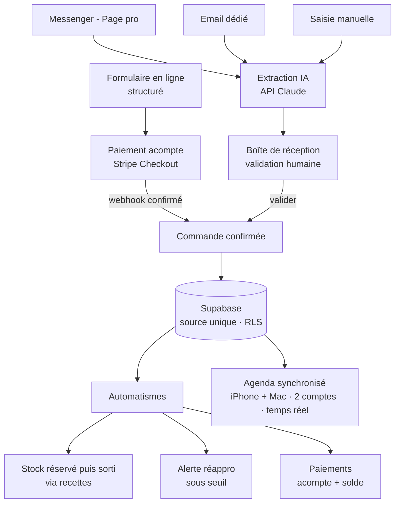

# Cahier des charges — HappyKreations (chocolats & meringues)

> Brief destiné à Claude Code pour développer l'application de bout en bout.
> Projet **HappyKreations** (dépôt GitHub + projet Supabase).

---

## 1. Objectif

Outil de gestion pour une micro-entreprise artisanale qui produit **coffrets de chocolats** et **cornets de meringues** vendus pour des événements (mariages, baptêmes, communions, etc.).

L'appli doit couvrir :
1. la **prise et le suivi des commandes** ;
2. un **agenda** des commandes (par date de livraison/retrait) avec vue de charge, **synchronisé entre tous les appareils** ;
3. la **gestion du stock de matières premières**, décrémenté **automatiquement** à partir des recettes ;
4. les **commandes fournisseurs** (réapprovisionnement) ;
5. l'**arrivée des commandes** par quatre canaux : **formulaire en ligne**, Messenger (Page pro), email, et saisie manuelle assistée ;
6. l'**encaissement des acomptes** via **Stripe** depuis le formulaire en ligne.

## 2. Contexte & utilisateurs

- **Deux utilisateurs** qui partagent **un seul espace de travail** (la même base, le même agenda). Chacun se connecte avec **son identifiant**.
- Ils travaillent sur **iPhone** et **Mac** — l'agenda et les commandes doivent être identiques et à jour sur les quatre appareils.
- Les commandes arrivent par **formulaire en ligne**, **Messenger** (Page Facebook pro), **email**, ou sont **saisies à la main**.
- **Compte Stripe** déjà disponible pour les paiements.
- Pas de génération de devis/factures PDF en v1 — uniquement un **suivi des paiements** (acompte / solde / reste dû).
- Micro-entreprise en **franchise en base de TVA** : montants en **TTC sans TVA** (aucun calcul de taxe à prévoir).

## 3. Plateforme & stack technique recommandée

- **Application** : SwiftUI multiplateforme, une seule codebase ciblant **iOS 17+** et **macOS 14+**.
- **Source de données unique + authentification** : **Supabase** (Postgres managé + API REST/Realtime + **Auth** + Edge Functions).
  - **Deux comptes** via **Supabase Auth** (email + mot de passe ou lien magique). Les deux voient et modifient les **mêmes données** (espace partagé), protégées par **RLS** autorisant les utilisateurs authentifiés de l'espace.
  - **Supabase Realtime** pousse les nouvelles commandes en direct sur l'agenda des deux personnes.
  - **Cache local** dans l'app pour le mode hors-ligne (lecture/édition puis synchro).
  - *Pourquoi pas iCloud/CloudKit* : la base privée CloudKit est liée à **un seul Apple ID** et ne se partage pas proprement entre **deux personnes** — le besoin « à deux » tranche en faveur de Supabase.
- **Formulaire de commande en ligne** : **page web hébergée** (Vercel / Cloudflare Pages / Netlify), distincte de l'app native, accessible par lien public. Elle lit le catalogue dans Supabase et y écrit les commandes.
- **Backend léger** : **Supabase Edge Functions** pour :
  1. créer les **sessions de paiement Stripe** (acompte) depuis le formulaire ;
  2. recevoir le **webhook Stripe** (confirmation de paiement) ;
  3. recevoir le **webhook Messenger** de la Page ;
  4. relever l'**email dédié** aux commandes ;
  5. appeler l'**API Claude** pour parser les messages Messenger/email en commande structurée.
- **Distribution** : compte **Apple Developer (~99 €/an)** requis pour une installation durable sur iPhone + TestFlight (un build signé avec un Apple ID gratuit expire au bout de 7 jours).

## 4. Modèle de données

| Entité | Champs principaux | Relations |
|---|---|---|
| **utilisateur** | id (auth), nom, rôle | crée commande / mouvement |
| **client** | id, nom, contact (tel/email/messenger), notes | 1—N commande |
| **produit** | id, nom, catégorie (coffret/cornet), prix_vente, déclinaisons, **visible_formulaire** (bool) | N—N matiere via recette |
| **matiere** | id, nom, unité, stock_actuel, seuil_alerte | 1—N ligne_recette, N—N fournisseur |
| **ligne_recette** | id, produit_id, matiere_id, quantité_par_unité | relie produit ↔ matiere |
| **commande** | id, client_id, canal (formulaire/messenger/email/manuel), type_evenement, date_evenement, date_retrait, statut, total, acompte, created_by, notes | 1—N ligne_commande, 1—N paiement |
| **ligne_commande** | id, commande_id, produit_id, quantité, prix_unitaire, déclinaison | — |
| **paiement** | id, commande_id, date, montant, moyen (stripe/espèces/virement), **stripe_session_id**, **stripe_payment_intent**, statut | — |
| **fournisseur** | id, nom, contact, notes | N—N matiere |
| **matiere_fournisseur** | id, fournisseur_id, matiere_id, référence, prix_achat, conditionnement | — |
| **bon_reappro** | id, fournisseur_id, date, statut | 1—N ligne_reappro |
| **ligne_reappro** | id, bon_reappro_id, matiere_id, quantité | — |
| **mouvement_stock** | id, matiere_id, date, type (entrée/sortie/réservation), quantité, origine | traçabilité |
| **commande_entrante** | id, canal, message_brut, donnée_extraite (JSON), statut (a_valider/importée/ignorée), reçu_le | file de l'auto-import (Messenger/email) |
| **capacite_jour** | id, date, plafond_unites, **bloque** (bool) | garde-fou du formulaire |
| **config** | clé, valeur (ex. `acompte_pourcent`, `delai_mini_jours`) | paramètres globaux |

## 5. Règles métier

### Statuts d'une commande
`Brouillon → À confirmer (devis) → Confirmée → En production → Prête → Livrée → Soldée`

### Décrément du stock (module « avancé »)
- Bascule en **Confirmée** : besoin en matières calculé via les recettes et **réservé** (mouvement `réservation`).
- Bascule en **En production** (ou **Prête**, à caler) : **sortie ferme** (mouvement `sortie`).
- **Stock disponible** = `stock_actuel − réservé` ; alerte à la saisie si insuffisant.

### Réapprovisionnement
- `stock_disponible` sous le **seuil** → **alerte** + proposition de **bon de réappro pré-rempli, groupé par fournisseur**.

### Paiements
- `reste_dû = total − somme(paiements)`. Schéma type : **acompte** (via Stripe sur le formulaire) à la commande, **solde** au retrait.
- Le `% d'acompte` est paramétrable (`config.acompte_pourcent`).

### Capacité (garde-fou du formulaire)
- Une date est **commandable** si elle n'est pas `bloque` et si la somme des unités déjà prévues < `plafond_unites`.
- Le formulaire **ne propose que les dates commandables** (+ un `délai_mini_jours` avant l'événement).

## 6. Formulaire de commande en ligne + Stripe

### Parcours client
1. Le client ouvre le **lien public** du formulaire.
2. Il choisit produits + quantités (catalogue = produits `visible_formulaire`), une **date commandable**, ses coordonnées, ses notes.
3. À la validation, une **session Stripe Checkout** est créée (montant = acompte) et le client paie sur la **page hébergée par Stripe**.
4. Le **webhook Stripe** (`checkout.session.completed`) confirme le paiement côté serveur → la commande passe **Confirmée**, l'acompte est enregistré, le créneau est réservé, et la commande **apparaît sur l'agenda des deux utilisateurs** (en temps réel).
5. En cas d'imprévu, **remboursement** possible depuis Stripe + passage de la commande en annulée.

### Points techniques
- **Stripe Checkout** (et non un formulaire de carte maison) → aucune donnée bancaire ne transite par votre code (conformité PCI gérée par Stripe).
- **Clés Stripe uniquement côté serveur** (Edge Functions / secrets), **jamais dans l'app ni la page web publique**.
- Session de paiement créée **côté serveur** (montant dynamique = acompte calculé).
- Confirmation **toujours via webhook signé**, jamais via le seul retour navigateur.

## 7. Modules / écrans de l'app

1. **Tableau de bord** — commandes à venir, alertes stock, encaissé du mois, reste dû global.
2. **Commandes** — liste filtrable + fiche + création/édition.
3. **Agenda** — calendrier par **date de retrait/livraison** + vue **« charge de la semaine »** ; **synchronisé temps réel** entre les deux comptes et leurs appareils.
4. **Boîte de réception** — `commande_entrante` à valider (Messenger/email) : message brut + commande pré-remplie → **Valider** / **Ignorer**.
5. **Stock matières** — quantités, seuils, alertes, mouvements.
6. **Recettes** — nomenclature produit → matières.
7. **Fournisseurs & réappro** — fiches + bons de réappro.
8. **Clients** — fiches + historique.
9. **Réglages** — catalogue exposé au formulaire, **% d'acompte**, **capacités/jours bloqués**, adresse email de commandes, connexion Page Facebook, clés API, comptes des deux utilisateurs.

## 8. Canaux d'entrée des commandes

- **Formulaire en ligne** *(structuré → pas d'IA)* : écrit directement une `commande` (Confirmée après paiement).
- **Saisie manuelle assistée** *(socle)* : on colle/partage le texte d'un message ; l'**API Claude** pré-remplit la commande ; validation humaine.
- **Email** *(auto)* : adresse dédiée relevée par le backend → parsing IA → `commande_entrante`.
- **Messenger Page** *(auto)* : app Meta + webhook + `pages_messaging` → parsing IA → `commande_entrante`. **Vérification business + revue de l'app Meta obligatoires.**

### Prompt de parsing (Messenger/email) — sortie attendue
```json
{
  "client": { "nom": "", "contact": "" },
  "canal": "messenger | email",
  "type_evenement": "",
  "date_evenement": "AAAA-MM-JJ | null",
  "date_retrait": "AAAA-MM-JJ | null",
  "lignes": [{ "produit": "", "quantite": 0, "declinaison": "" }],
  "notes": ""
}
```
> **Règle de sécurité** : jamais d'import aveugle des messages — toute commande issue de Messenger/email passe par la **boîte de réception** pour validation humaine. (Le formulaire, lui, étant structuré, peut créer directement la commande.)

## 9. Pipeline du workflow

Vue d'ensemble du parcours d'une commande, de son arrivée jusqu'à son affichage sur l'agenda. **Deux routes** : le **formulaire** arrive déjà structuré et payé (il saute la validation) ; les canaux **texte** (messenger, email, saisie) passent par l'extraction IA puis la boîte de réception.



## 10. Découpage en phases

| Phase | Contenu | Résultat |
|---|---|---|
| **1 — Cœur** | Supabase + **Auth 2 utilisateurs** + modèle de données + Commandes + Agenda (sync temps réel) + Stock + Recettes (décrément auto) + Fournisseurs/réappro + Clients + paiements + **saisie assistée** | Appli **pleinement utilisable** à deux |
| **2 — Formulaire + Stripe** | Page web publique + catalogue + capacité + **Stripe Checkout** + webhook → commande Confirmée sur l'agenda | Les clients **commandent et paient l'acompte** en autonomie |
| **3 — Email** | Relève email dédié + parsing → boîte de réception | Auto-import email |
| **4 — Messenger** | App Meta + webhook Page + parsing → boîte de réception | Auto-import Messenger |

> **À lancer tôt, en parallèle** : la **vérification business Meta** (délai de validation = vrai goulot de la phase 4).

## 11. À préparer côté commanditaire

- [ ] Un **Mac avec Xcode**.
- [ ] Un **compte Apple Developer** (~99 €/an).
- [ ] Un **projet Supabase** (gratuit) + clés d'API + les **deux comptes utilisateurs**.
- [ ] Le **compte Stripe** (déjà dispo) + clés API + secret du webhook.
- [ ] Un **hébergement** pour la page formulaire (Vercel / Cloudflare Pages).
- [ ] Une **clé API Anthropic** (parsing Messenger/email).
- [ ] Une **adresse email dédiée** aux commandes (phase 3).
- [ ] Accès **admin Page Facebook pro** + **compte Meta for Developers** (phase 4).

## 12. Décisions encore ouvertes

- **% d'acompte** demandé sur le formulaire, et **délai minimum** avant l'événement.
- **Règle de capacité** : plafond d'unités par jour, par semaine, ou simples jours bloqués ?
- Gestion fine des **déclinaisons** (parfums de meringues, assortiments) : variantes simples ou recettes distinctes ?
- Le formulaire confirme-t-il **automatiquement** après paiement (recommandé), ou faut-il une validation manuelle avant encaissement ?
- **Sauvegarde / export** des données (CSV / export comptable annuel).
